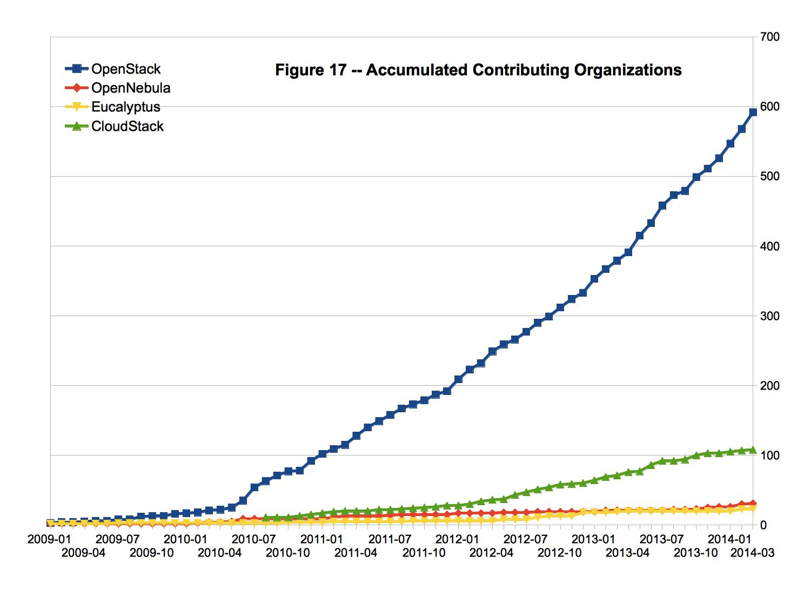
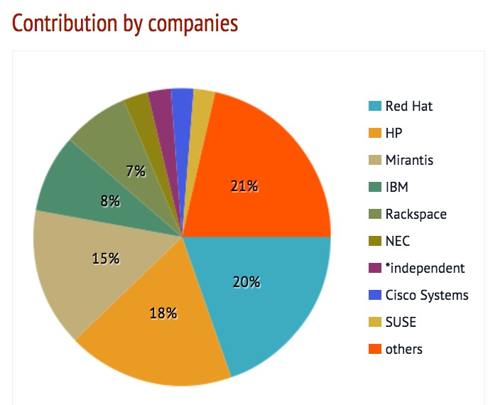

## 众人拾柴，方成燎原之势

### 开源平台：OpenStack 使用感受

<small> Created by [张鹏飞](http://pengfei-zhang.com) / [上海交通大学](http://omnilab.sjtu.edu.cn) </small>

*** =pnotes
Some notes on the first slide

---

## Outline

- 开源，从 Free 到 Open
- OpenStack开源，为什么这么火
- 上海交通大学OpenStack案例介绍
- 思考：高校与开源

--- &vertical ds:alert

# FREE ≠ Open Source

***

## GNU & GPL

### 关键词，不是免费，是自由

- GNU : GNU's not Unix 
- GPL : The GNU General Public License
 

>Our mission is to preserve, protect and promote the freedom to use, study, copy, modify, and redistribute computer software, and to defend the rights of Free Software users. — Richard Stallman

***

## OpenSource : Apache / BSD

- 同样是开源，但是更温和
- 更像是拿来主义

--- &vertical

## OpenStack ： 开源的新宠儿

<small>说起云计算，不得不提到一个问题：_____哪家强？</small>

***

## NASA + rackspace

***

## OpenStack Today:

***

## 爆发式的增长

- 17141 contributor
- 432 sponsor
- 140+ countries

***

***

***
## 那么问题又来了。。。

同样是开源，为什么OpenStack能够如此之快的成长？

--- &vertical

# How Open is OpenStack?

***

## Open Source

> - 开源协议采用 Apache License 2.0
> - 企业可以拿来做成自己的产品
> - 参与者越来越多

***

## Open Design

> - 非某公司拥有 （如Android)
> - 非某公司主导 （如CloudStack）
> - 基金会管理，共同参与决策
> - _想要更过话语权？请砸更多工程师_

***

## Open Devolopment

- Public route map
- Public code review
- Free summit ticket

***

## Open Community

- Committee负责协调、选型和规模控制
- 开发者友好：PTL-Core-Reviewer 的多级架构
- 公司友好：无论商业还是开源方案，都可以找到支持

***

## Let's build the LEGO together

---

## OpenStack in SJTU

---

## Thank you!

