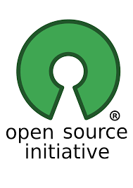
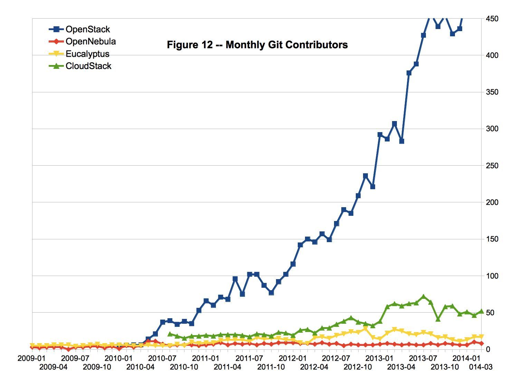
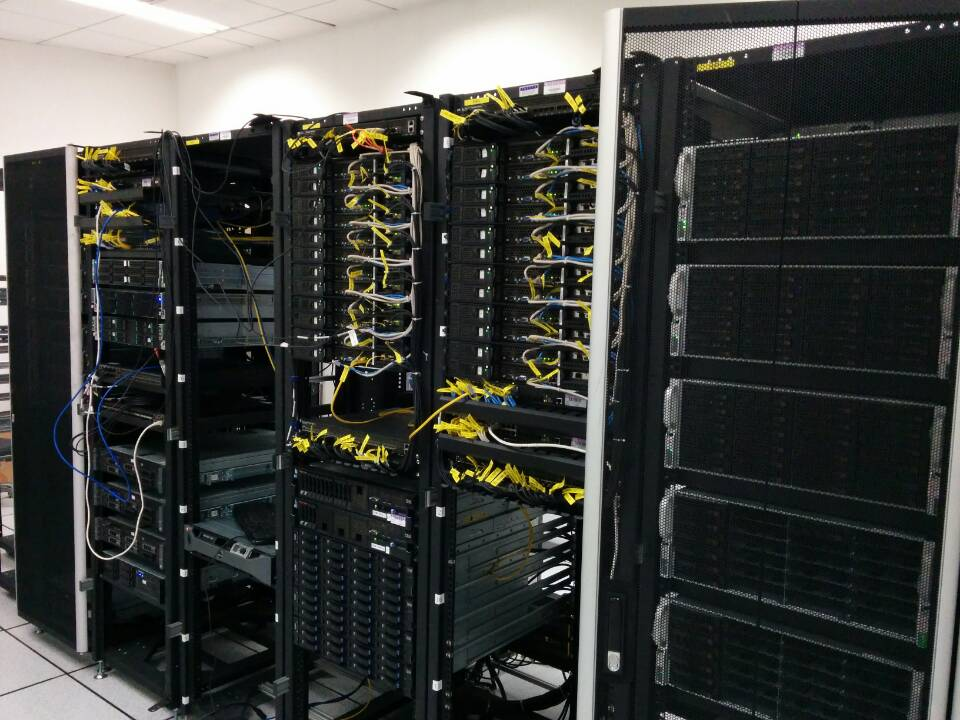
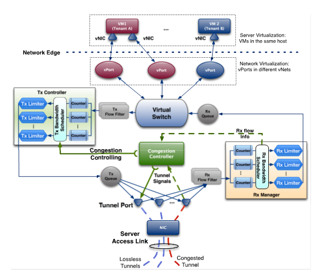
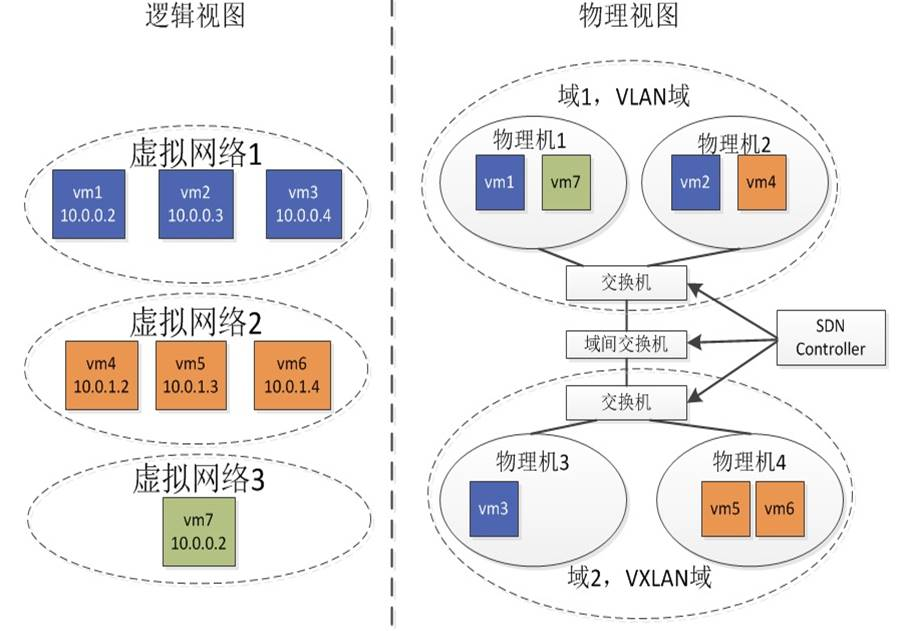
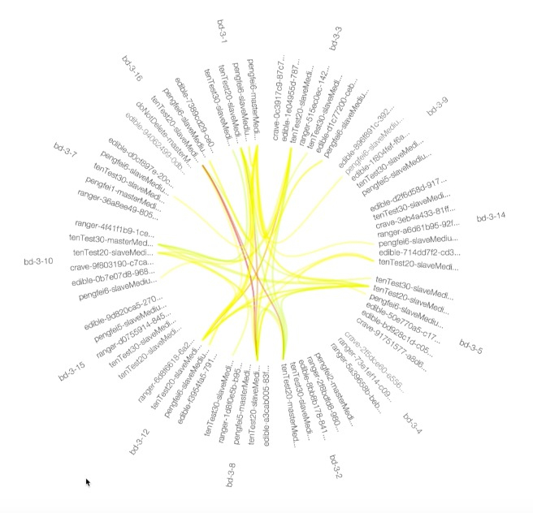

## 开源盛世

### 一个PhD的开源观

<small> Created by [张鹏飞](http://pengfei-zhang.com) @ [上海交通大学](http://omnilab.sjtu.edu.cn) </small>

*** =pnotes
Some notes on the first slide

---
## About Me

- 上海交通大学土著, PhD 在读
- 自2011年接触OpenStack开源社区
- 2013-2014: Cisco硅谷总部参与OpenStack开发

---
## Outline

- 开源，从 Free 到 Open
- OpenStack开源，为什么这么火
- 上海交通大学OpenStack案例介绍
- 思考：高校与开源

--- &vertical

## 开源盛世

- Sofware is eating the World
- Open Source is eating Software world

*** ds:alert
# FREE ≠ Open Source

***

# GNU & GPL

## 关键词，不是免费，是自由

- GNU : GNU's not Unix 
- GPL : The GNU General Public License
 

>Our missipic/on is to preserve, protect and promote the freedom to use, study, copy, modify, and redistribute computer software, and to defend the rights of Free Software users. — Richard Stallman

***

## OpenSource : Apache / BSD

- 同样是开源，但是更温和
- 更像是拿来主义

--- &vertical

## Cloud & Open Source

<small>说起云计算，不得不提到一个问题：_____哪家强？</small>

*** 

## OpenStack ： 开源的新宠儿

*** 

## NASA + rackspace

*** 

## OpenStack Today:

- 计算（Compute）：Nova
- 对象存储（Object）：Swift
- 镜像（Image）：Glance
- 身份（Identity）：Keystone
- 网络&地址管理（Network）：Neutron
- 块存储 (Block)：Cinder
- UI 界面 (Dashboard)：Horizon
- 测量 (Metering)：Ceilometer
- 编配 (Orchestration)：Heat

*** 

## 爆发式的增长

- 17141 Individuals
- 432 Supporting companies
- 145 Organizations contributing code
- 20 Million lines of code
- Thousands of patches merged every release
- Hundreds of millions of investment dollars

*** 
<small>http://www.qyjohn.net/?p=3373</small>

***
<small>http://www.qyjohn.net/?p=3373</small>

***
## 那么问题又来了。。。

同样是开源，为什么OpenStack能够如此之快的成长？

--- &vertical ds:submerge

# How Open is OpenStack?

***

# Open Source

> - 开源协议采用 Apache License 2.0
> - 企业可以拿来做成自己的产品
> - 参与者越来越多

***

# Open Design

> - 非某公司拥有 （如Android)
> - 非某公司主导 （如CloudStack）
> - 基金会管理，共同参与决策
> - _想要更过话语权？请砸更多工程师_

***

# Open Community

- Committee负责协调、选型和规模控制
- 开发者友好：PTL-Core-Reviewer 的多级架构
- 公司友好：无论商业还是开源方案，都可以找到支持

***

# Open Devolopment

- Public route map
- Public code review
- Free summit ticket

***

## Let's build the LEGO together

--- &vertical 

## OpenStack in SJTU

*** ds:soothe

Remember <q>Free ≠ Open Source</q> ?

# Open Source ≠ Free

- 自2011年开始参与
- 投入11人
- 多次参与Design Summit

*** 

## 平台概况

- 实验平台，尝试各种新技术
- 服务平台，为学校提供云服务

***

## 实验平台

- 24 Servers
- 6 10G Switch
- SDN enabled environment

***

## 服务平台

- 科学计算
- Web 服务
- 开发/测试
- 教学辅助

--- &vertical ds:cobalt

## R & D

- Research: 从实际运营中抽象出研究问题
- Development: 补丁、插件、新框架，回馈社区

*** ds:cobalt

## 网络带宽保证

*** ds:cobalt

## SDN 多域虚拟化

*** ds:cobalt

## Big Data in Cloud

网络流量分析 

---

## 感悟OPEN:

- Outlook
- People
- Enterprise
- Networking

---

## Thank you!

- 本Slides使用 R + Slidify 编写，感谢Ramnath Vaidyanathan大神的开源工具
- Slides观看地址: http://pengfei-zhang.com/mydeck
- Github源码地址: https://github.com/HolySparky/mydeck

